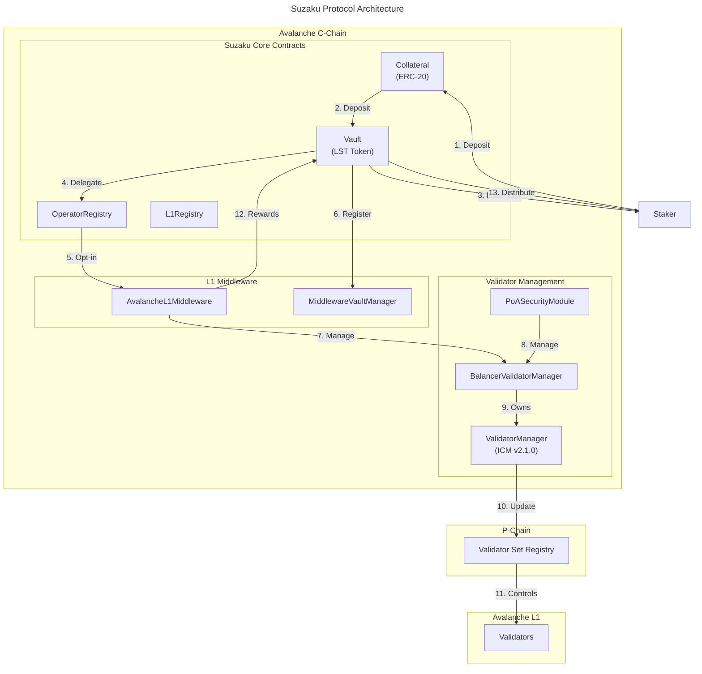

import { Callout, Cards, Card } from "nextra/components";

<Cards>
  <Card
    title="Building a blockchain? Get in touch with us!"
    href="https://forms.gle/US695J3BYoy8tztu9"
    target="_blank"
  />
</Cards>

# Protocol Specifications

Suzaku specifications

## Protocol smart contracts

For detailed documentation, see:
- [Suzaku Core Documentation](https://github.com/suzaku-network/suzaku-core/blob/main/docs)
- [Suzaku Contracts Library](https://github.com/suzaku-network/suzaku-contracts-library)

### Core contracts

The Suzaku Protocol consists of the following core contract modules deployed on the Avalanche C-Chain:

- **Collateral modules**
  - The [`DefaultCollateral`](https://github.com/suzaku-network/suzaku-core/blob/main/src/contracts/collateral/DefaultCollateral.sol) along with the [`DefaultCollateralFactory`](https://github.com/suzaku-network/suzaku-core/blob/main/src/contracts/collateral/DefaultCollateralFactory.sol) enable ERC-20 tokens to be used as collateral in the protocol
  - Collaterals for assets like $sAVAX and $BTC.b are deployed and available for use
  - See [Collateral documentation](https://github.com/suzaku-network/suzaku-core/blob/main/docs) for details
- **Vault modules**
  - [`VaultTokenized`](https://github.com/suzaku-network/suzaku-core/blob/main/src/contracts/vault/VaultTokenized.sol) contracts accept collateral deposits and issue LST tokens (Liquid Staking Tokens)
  - L1 teams deploy and curate vaults for their networks, with technical support from the Suzaku team
  - Vaults delegate staked tokens to operators who run validators via the [`Delegator`](https://github.com/suzaku-network/suzaku-core/blob/main/src/contracts/delegator) contracts
  - See [Vault documentation](https://github.com/suzaku-network/suzaku-core/blob/main/docs) for details
- **Network modules**
  - The [`AvalancheL1Middleware`](https://github.com/suzaku-network/suzaku-contracts-library/blob/main/src/contracts/Middleware/AvalancheL1Middleware.sol) handles operator registration, vault registration, stake accounting, and slashing for Avalanche L1s
  - The [`L1Registry`](https://github.com/suzaku-network/suzaku-core/blob/main/src/contracts/registry/L1Registry.sol) maintains a registry of eligible Avalanche L1 networks
  - The [`MiddlewareVaultManager`](https://github.com/suzaku-network/suzaku-contracts-library/blob/main/src/contracts/middleware/MiddlewareVaultManager.sol) manages vault registration and stake limits for each L1
- **Operator modules**
  - The [`OperatorRegistry`](https://github.com/suzaku-network/suzaku-core/blob/main/src/contracts/registry/OperatorRegistry.sol) maintains a registry of eligible operators
  - Operators register and opt-in to L1s and vaults they want to work with
  - Operators run validators for L1s and receive rewards based on validator uptime
- **Resolver modules**
  - Resolvers detect slashing offenses and can trigger slashing of operator stake
  - Currently, Suzaku launches without slashing, but resolver infrastructure is in place for future implementation
  - See [Resolver documentation](https://github.com/suzaku-network/suzaku-core/blob/main/docs) for details

### Avalanche L1 validator set management contracts

The core contracts are used in coordination with validator set management contracts (see [ACP-99](https://github.com/avalanche-foundation/ACPs/tree/main/ACPs/99-validatorsetmanager-contract)) to translate Suzaku operations into Avalanche validator set updates. All L1s on Avalanche maintain their validator set on the P-Chain that acts as a shared registry.

#### BalancerValidatorManager

The [`BalancerValidatorManager`](https://github.com/suzaku-network/suzaku-contracts-library/blob/main/src/contracts/ValidatorManager/BalancerValidatorManager.sol) is an ACP-99-compliant contract that wraps the ICM `ValidatorManager` (v2.1.0) and implements a validator management system allowing multiple security modules to control portions of the validator set. Each security module is allocated a maximum weight they can assign to their validators.

**Key Features:**
- Multiple security modules can operate independently to manage validators
- Each security module has a maximum weight allocation they cannot exceed
- Tracks and enforces security module weight limits
- Supports wrapping existing ValidatorManagers that already have validators
- Enforces validator ownership by security modules

**Architecture:**
- The BalancerValidatorManager owns the underlying ValidatorManager
- Security modules interact with the BalancerValidatorManager, not directly with the ValidatorManager
- All validator operations are tracked and attributed to their managing security module
- Weight limits are enforced at the BalancerValidatorManager level

For complete documentation, see the [BalancerValidatorManager README](https://github.com/suzaku-network/suzaku-contracts-library/blob/main/src/contracts/ValidatorManager/README.md).

#### Security Modules

**PoASecurityModule**

The [`PoASecurityModule`](https://github.com/suzaku-network/suzaku-contracts-library/blob/main/src/contracts/ValidatorManager/PoASecurityModule.sol) provides Proof of Authority (PoA) style validator management:

- Owner-controlled validator management using OpenZeppelin's `Ownable`
- Immutable BalancerValidatorManager reference
- Delegates all operations to the BalancerValidatorManager
- Owner can initiate validator registration, removal, and weight updates
- Anyone can complete operations once acknowledged by the P-Chain (improving liveness)

**AvalancheL1Middleware**

The [`AvalancheL1Middleware`](https://github.com/suzaku-network/suzaku-contracts-library/blob/main/src/contracts/Middleware/AvalancheL1Middleware.sol) manages operator registration, vault registration, stake accounting, and slashing for Avalanche L1s in the Suzaku Protocol:

- Handles operator registration and opt-in to L1s
- Manages vault registration and stake limits
- Tracks stake accounting for validators
- Enforces staking requirements (primary and secondary assets)
- Integrates with the BalancerValidatorManager to update validator sets

For more details, see:
- [BalancerValidatorManager README](https://github.com/suzaku-network/suzaku-contracts-library/blob/main/src/contracts/ValidatorManager/README.md)
- [Suzaku Contracts Library](https://github.com/suzaku-network/suzaku-contracts-library)
