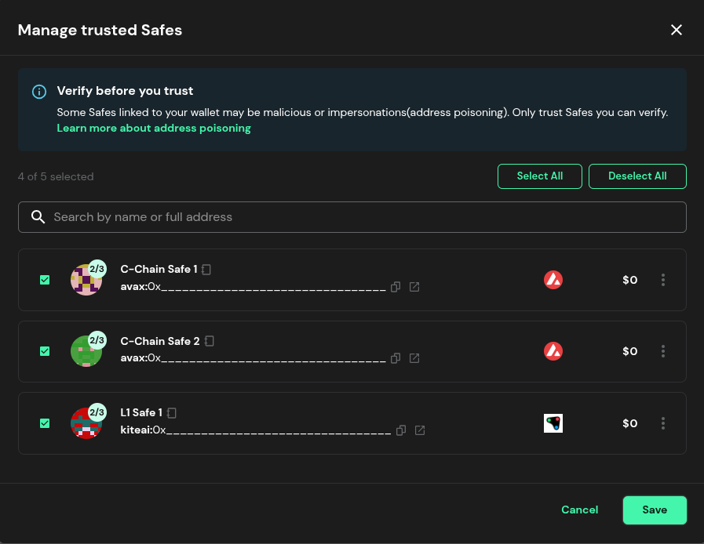
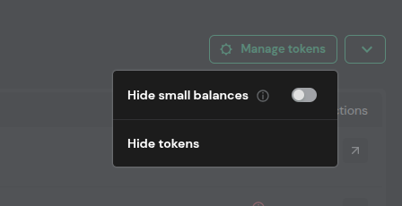

Nearly 2 years ago, [Ash Wallet was announced](/blog/announcing-ash-wallet), promising to **bring [Safe](https://safe.global) multi-signature wallet capabilities** to all Avalanche L1s.

Since then, up to 10 L1 teams have used Ash Wallet in mainnet for their daily treasury and admin operations, and more teams have been experimenting in testnet, including on the Fuji C-Chain instance.

Today, Ash Wallet expands to **support the Avalanche C-Chain on mainnet**, becoming your **preferred interface** for interacting with your Safe wallets on the network.

# What you need to know

[wallet.ash.center](https://wallet.ash.center) is now the **unified interface to interact with Safes** across the **Avalanche ecosystem**, for the C-Chain and L1s alike.

## Links

- Ash Wallet UI: https://wallet.ash.center
- Support in [Suzaku Discord server](https://discord.gg/4XP6aqFkKX) (`🔥|ash-wallet` channel)

## Interacting with existing C-Chain Safes

To start using Ash Wallet, head over to [https://wallet.ash.center](https://wallet.ash.center/welcome), connect your software wallet, and **add your trusted Safes**. Safes previously created on the Avalanche C-Chain (and L1s) will appear in the wizard.

Once your Safe is trusted, you can interact with it exactly like you did through the [app.safe.global](https://app.safe.global) UI.

### Missing tokens

Some tokens and DeFi positions might not appear directly in your Safe due to missing price feeds. To show all tokens, head over to the Assets tab and disable the Hide small balances option.

## Creating new Safes

To create a new Safe, go through the [**Create account** wizard](https://wallet.ash.center/new-safe/create): name the wallet, add signers, and configure the signer threshold.

# Never fully trust a web UI for your critical operations

While we are doing everything possible to adhere to **best-in-class SecOps standards** for Ash Wallet, we have seen  in recent years that **even the best teams can be hacked**.

To **maximize the security** of your Safe operations, always follow the **best practices outlined in the transaction signing process**:

1. **Review what you will sign:** Signing is an irreversible action, so make sure you know what you are signing. [Read more](https://help.safe.global/en/articles/276343-how-to-perform-basic-transactions-checks-on-safe-wallet)
2. **Compare with your wallet:** Once you click Sign, the transaction will appear in your signing wallet. Make sure that all the details match.
3. **Verify with external tools:** You can additionally cross-verify your transaction data in a third-party tool like [Safe Utils](https://safeutils.openzeppelin.com/)

# Get in touch if needed

If you experience issues with Ash Wallet, the Suzaku team is available to help you troubleshoot. You can get in touch with us [on Discord](https://discord.gg/4XP6aqFkKX) (`🔥|ash-wallet` channel) or [on X](https://x.com/ash_avax).

# About Ash

[Ash](https://ash.center) is the infra arm of Suzaku. It provides L1 builders with a range of infrastructure services via open-source tools and professional services. We assist teams from the development phase to mainnet deployment and beyond, helping secure and decentralize sovereign networks.

Ready to deploy your custom-made Appchain on **your infrastructure**? Want to discuss how your dApp could benefit from running on its dedicated blockchain? [Book a call with us!](https://calendly.com/ash-e36knots/)
