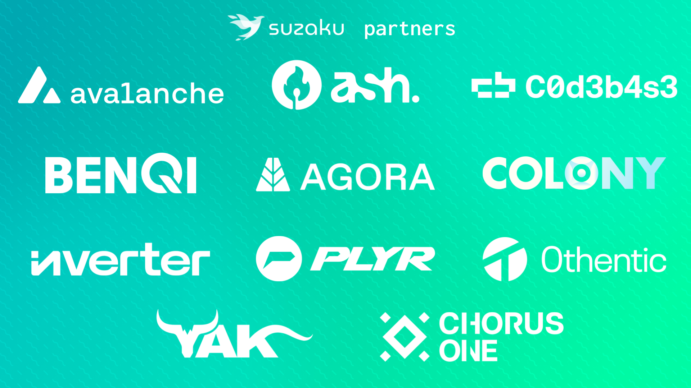

We are very excited to unveil Suzaku, a (re)staking protocol dedicated to helping [Avalanche L1s](https://build.avax.network/docs/avalanche-l1s) scale and decentralize their validator set securely.

For this purpose, Suzaku provides builders with a unified framework that encapsulates reference network architectures, an L1 development stack, and battle-tested security modules to choose from. [The Suzaku security modules](https://docs.suzaku.network/suzaku-protocol/for-builders/introduction#security-modules) enable each L1 to curate the rules enforced to their validator set and smoothly transition between different models according to their maturity stage.

Thanks to Suzaku, every L1 can connect with communities of operators and stakers to operate its infrastructure and boost its cryptoeconomic security.

## An L1’s Journey Toward Decentralization and Sovereignty

Here are the different security models that an L1 could go through in its journey toward full decentralization and sovereignty:

- **Permissioned - Proof-of-Authority (PoA) security:** the L1 core development team controls the validator set. It whitelists nodes from trusted partners. All Avalanche L1s on mainnet today are using PoA.
- **Semi-permissioned - PoA + Dual-Staking security:** the L1 opens up a portion of its validation power (e.g. 50%) to external operators, requiring them to stake the L1 native token, as well as restake a blue-chip token to maximize the network security.
- **Permissionless - Dual-Staking security:** the L1 progressively transitions all the validation power to dual-staked operators, effectively becoming permissionless. It is still relying on the restaked token for its cryptoeconomic security.
- **Sovereign - Proof-of-Stake (PoS) security:** once the L1 has reached maturity and its token is enough distributed and capitalized, it can progressively remove the restaking requirements for operators, claiming its sovereignty.

All those models can be implemented using Suzaku [security modules](https://docs.suzaku.network/suzaku-protocol/for-builders/introduction#security-modules).

## Connecting L1s with Stakers and Operators

Stakers and operators are critical players in the L1 journey. This is why Suzaku effectively implements a marketplace between the protocol participants:

- **Stakers** opt-in to provide cryptoeconomic security to L1s in exchange for extra rewards through (re)staking, delegating their collateral to curators;
- **Operators** are rewarded to run the infrastructure for L1s of their choosing, ensuring high SLAs;
- **Curators** select L1s to secure and operators to delegate to, and distribute rewards to their stakers;
- Finally, **L1s** can tap into the collateral provided by stakers for their cryptoeconomic security and rely on operators to run their validators with a high degree of confidence.

Learn more about the roles and interactions between the Suzaku protocol participants in [our docs](https://docs.suzaku.network/suzaku-protocol#protocol-participants).

### Why Avalanche?

Many people ask us this question, and the answer is straightforward: we firmly believe Avalanche is poised to become the premier platform for launching sovereign networks. Here's why.

### The Avalanche Stack

Avalanche L1 builders benefit from:

- **The best consensus protocol** on the market: the Avalanche Consensus offers single-block immutable finality and can scale to thousands of nodes with minimal impact on performance.
- **A highly flexible platform**, where they can choose the VM that best fits their use case: an EVM extendable by stateful precompiles, a HyperVM that can reach up to 100k TPS, a MoveVM to maximize security, and more to come.

### Avalanche9000

Moreover, a massive revamp of the Avalanche protocol is brewing. Thanks to [ACP-77](https://github.com/avalanche-foundation/ACPs/tree/main/ACPs/77-reinventing-subnets), it will soon be possible to:

- **Run a validator for any Avalanche L1 without validating the Avalanche Primary Network**, and therefore without having to stake 2,000 AVAX
- **Enforce any set of rules to an L1 validator set**, enabling innovative security models (like those described above).
  Enforce any set of rules to an L1 validator set, enabling innovative security models (like those described above).

Those changes are a true unlock for L1 builders, unleashing the true potential of Avalanche.

Everything is coming together during [Avalanche9000](https://www.avax.network/about/blog/building-on-avalanche9000)'s incentivized testnet, and Suzaku will be involved extensively.

## The Suzaku Roadmap

### Suzaku Restaking dApp

**Wednesday 9th October** will mark the first big step of Suzaku’s roadmap with the release of the Suzaku dApp where stakers can get familiar with the protocol and restake blue-chip tokens of the Avalanche ecosystem to earn Suzaku points. At launch sAVAX, BTC.b, and AUSD will be supported as collateral.

The dApp will be available at [app.suzaku.network](https://app.suzaku.network)

Follow our official channels to get notified!

Follow the [Staker's documentation](https://docs.suzaku.network/suzaku-protocol/for-stakers/introduction) to get started.

### The Next Milestones

The next big milestones of Suzaku are:

- **Suzaku (Re)staking testnet:** multiple security modules will be developed and tested with partner L1s. Users will be invited to participate in this phase to help battle-test the protocol.
- **Support of new tokens as collateral** in Suzaku Restaking
- **SuzakuRN (Relayer Network) testnet:** the Suzaku team will develop its own L1 dedicated to supercharging AWM (Avalanche Warp Messaging) with censorship resistance and validity
- **Suzaku (Re)staking mainnet and SuzakuRN mainnet**
- **Suzaku Expansion…**

## Suzaku Launch Partners

We are proud to reveal the list of partners that will be on our side at the beginning of this journey:

- **[Avalanche](https://avax.network):** Suzaku is specifically tailored to secure sovereign networks built with the Avalanche L1 stack and the protocol core contracts will be deployed on the Avalanche C-Chain. Moreover, Suzaku supports BTC.b, Avalanche native wrapped Bitcoin, as a restaking collateral at launch.
- **[Ash](https://ash.center):** As the one-stop shop for L1 development and operation on Avalanche, Ash is a match made in heaven with Suzaku! L1 builders can address all their needs by combining them: operate the core team/foundation validators with Ash and securely open their validator set to external operators with Suzaku.
- **[Codebase](https://codebase.avax.network):** Suzaku was (re)born from the Ash(es) team acceleration at Codebase, the official Avalanche incubator. As part of the Codebase S’24, Léo and Gauthier, the co-founders of Ash benefit from the unparalleled experience of the program’s mentors to refine and bootstrap Suzaku.
- **[BENQI](https://benqi.fi):** Suzaku sovereign networks can use BENQI’s sAVAX, the biggest AVAX LST, as restaked collateral to boost their cryptoeconomic security. BENQI also operates the largest lending protocol of the Avalanche ecosystem and will open new isolated markets for Suzaku LRTs (Liquid Restaking Tokens).
- **[Agora](https://agora.finance):** AUSD (Agora USD), a next-generation stablecoin that shares revenue with builders and businesses, will enable sovereign networks to have a more predictable amount of cryptoeconomic security.
- **[Colony](https://colony.io):** The community-driven accelerator within the Avalanche ecosystem empowers builders to raise capital while enabling Web3 enthusiasts to invest in the earliest stages of high-potential projects. It also offers a wide array of DeFi products and rewards for the community. Suzaku and Colony are collaborating on an innovative approach to add “secure decentralization” as one of the accelerator’s offerings.
- **[Inverter](https://inverter.network):** The Suzaku team is partnering with Inverter, the token economies experts, to help builders make the best decisions regarding reward tokens issuance, token distribution, etc. The Suzaku protocol will be compatible with Inverter tokenization modules out of the box.
- **[PLYR](https://plyr.network):** PLYR is revolutionizing Web3 gaming by providing a one-stop-shop ecosystem for game developers. PLYR CHAIN is one of the first networks to leverage Suzaku for building its cryptoeconomic security. This partnership will help tailor the Suzaku protocol for Avalanche L1s as PLYR will be integrated during the Avalanche9000 testnet.
- **[Othentic](https://othentic.xyz):** Suzaku leverages the Othentic Stack to bridge cryptoeconomic security to Avalanche from other restaking marketplaces like EigenLayer and Babylon.
- **[Yield Yak](https://yieldyak.com):** Yield Yak is the go-to yield aggregator on Avalanche and will be the first curator of the Suzaku ecosystem. Stakers can leverage Yak LRTs (Liquid Restaking Tokens) to deposit their assets into Suzaku and utilize their positions within the broad Avalanche DeFi ecosystem.
- **[Chorus One](https://chorus.one):** Suzaku-secured L1s will benefit from the invaluable experience of Chorus One, a leading staking provider, managing over 3 billion USD in assets across more than 50 networks. Chorus One will help battle-test the protocol during the Avalanche9000 testnet and provide their services after our mainnet launch!

## Join the Community

To stay in the loop of all our upcoming updates, join our community on:

- **X:** [@SuzakuNetwork](https://x.com/SuzakuNetwork)
- **Discord:** [Suzaku server](https://discord.com/invite/4XP6aqFkKX)
