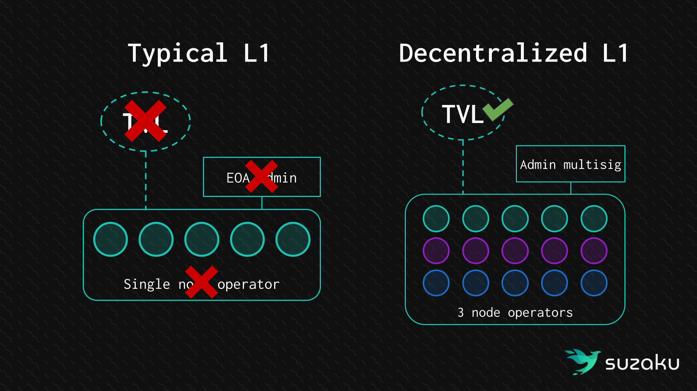
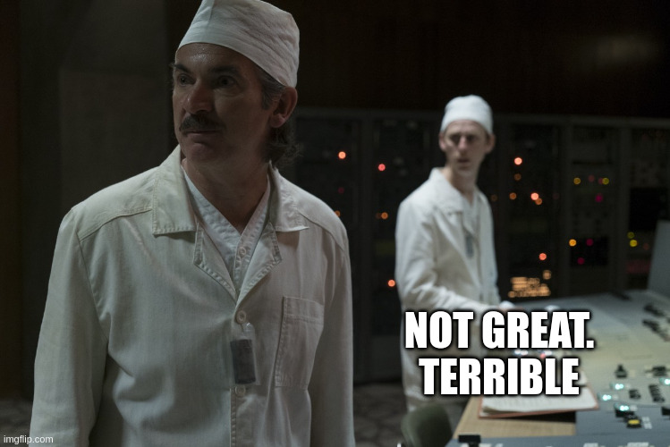
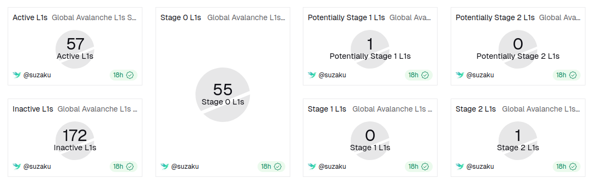
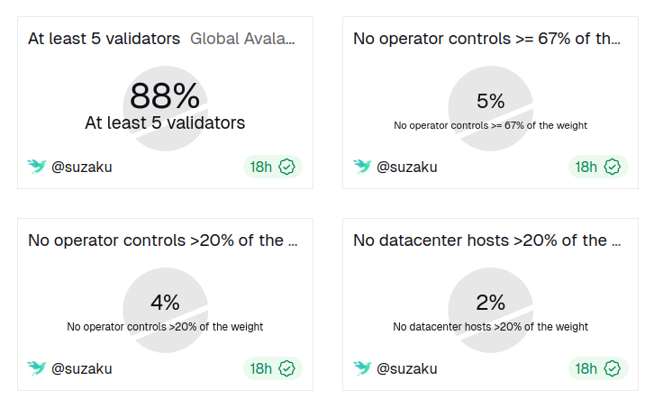
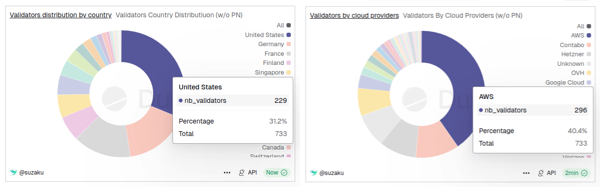
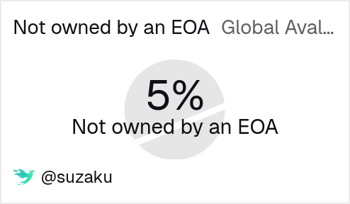

As discussed in our previous article, [_Why L1 Decentralization Matters_](/blog/why-l1-decentralization-matters), centralized Layer One (L1) blockchains face significant **operational security (OpSec) risks**. Decentralization of the L1’s control, both at the software and hardware level, is the only viable protection mechanism.

Many Avalanche L1s are not sufficiently decentralized. **Not because they don’t care about security**, but because **they are not aware of the risks** they face. This is why, in the past few months, we set out to **build tooling for L1 builders** to help them better identify those risks and what quick-win actions they can take.

Today, we share our first tool: the [**Avalanche L1s Decentralization Dashboard**](https://dune.com/suzaku/avax-l1s-decentralization), along with the findings it provides to the community. This Dune dashboard **classifies all active Avalanche L1 chains in Stages** based on decentralization requirements we deem critical to their users’ security.

# Reminder of the risks

Most Avalanche L1s face **two layers of security risk** that often go unaddressed. At the hardware level, **a single provider running all validators** means one breach, like the $1.4B ByBit hack of February 2025, gives an attacker enough control to **drain all bridged TVL**. At the software level, validator set contracts with **admin and upgrade rights held by a single account** are just as dangerous: one compromised wallet and **the entire validator set can be reshaped** at will.

The good news is that both risks have the same remedy: **distribute control**. Onboarding **two extra independent operators** can already eliminate the hardware SPOF. Securing contract admin rights behind a **multisig or governance** does the same on the software side. These first steps go a long way, and the longer a team waits, the more is at stake.

Read more in our previous article: [_Why L1 Decentralization Matters_](/blog/why-l1-decentralization-matters)

# Avalanche L1s Stages

The Stages classification used here was first described in a **proposal made by the Suzaku team** in the ACP (Avalanche Community Proposal) forum: [Nuttymoon's comment in discussion #249](https://github.com/avalanche-foundation/ACPs/discussions/249#discussioncomment-15015386). They take inspiration from [L2Beat](https://l2beat.com) and the Ethereum community classification of Layer 2s.

We will propose an ACP to formalize them soon. Thus, they are still subject to adjustment.

As in the dashboard, we’ll **focus only on Stages 1 and 2** in this article, as Stage 3 is too far along for most L1s anyway. Here is a brief description of each Stage:

- **Stage 0: Insufficient decentralization** with negative impact on bridged TVL security, liveness, and censorship resistance
- **Stage 1: Minimal decentralization** that eliminates single points of failure for bridged TVL and liveness
- **Stage 2: Good decentralization** that ensures bridged TVL security, liveness, and censorship resistance

And here are the requirements for each, classified by security property:

## Stage 1

Bridge TVL Security:

- **Validator set management is not controlled by a single EOA**  
  A breach of a single EOA could lead to validator set changes and potential loss of funds bridged to the L1. This can be enforced by setting up multisignature wallet ownership or governance-based security.
- **Each operator controls strictly less than 67% of the L1 total weight**  
  A single operator's breach could lead to a loss of all funds bridged to the L1.

Liveness:

- **The L1 has at least 5 validators**  
  Below this threshold, any single validator failure would halt the chain (if validator weights are equal)

## Stage 2

Liveness

- **No more than 20% of the L1 total weight is controlled by a single operator**  
  A single operator failure would halt the chain.
- **No more than 20% of the L1 total weight is hosted on a single data center**  
  Concentration in a single data center creates a critical infrastructure failure point.
- **All validators are hosted in OFAC-compliant jurisdictions**  
  Validators in sanctioned jurisdictions expose the L1 to compliance risk and potential forced censorship of transactions.
- **The L1 has multiple RPC endpoints operated by different entities**  
  A single operator's outage could lead to censorship of user transactions.
- **Validator ownership of more than 67% of the L1 total weight is verified at the social layer**

## Methodology used in the dashboard

We use [Dune Analytics](https://dune.com) to aggregate **onchain and offchain data** and determine the stage of each L1. Those data include:

- `ValidatorManager` contract ownership (onchain)
- Validators control and distribution, between entities and data centers (both onchain & offchain)

Some requirements are not yet implemented and need more work (e.g. the social layer verification of validator ownership). You can read more about the exact methodology used to compute each requirement in the [doc of our L1 Auditor tool](https://docs.suzaku.network/l1-auditor) (upcoming tool, yes, this is an alpha 😱).

# Disclaimer on our goal as Suzaku

The ultimate goal of this work is not to shame L1 teams, but to **help them assess risks**. This has always been the purpose of the Suzaku team: to help L1s decentralize securely, or rather to help L1s secure through decentralization.

## Alignment with the current dynamic on Avalanche

As [stated by Matias](https://x.com/frostLedger/status/2021625946189824355?s=20), who recently took the role of CIO of the Avalanche Foundation:

> Real problems require honest diagnosis before we can fix them.

Today, Suzaku brings its contribution to the groundwork that started in the Avalanche community, led by [Matias](https://x.com/frostLedger) and [Eric](https://x.com/eric_lu_sc/status/2023367915425427729?s=20): **transparent data to create effective action**.

# What the data shows us on L1s’ decentralization

TL;DR: **Not great. Terrible** even.

Of the 57 live L1s, only 1 qualifies as Stage 2: the Avalanche Primary Network, one of the most decentralized chains in crypto. All the other L1s are Stage 0, meaning they could be in serious trouble if a single entity were to be compromised.

## Many validators ≠ decentralized

The main issue of L1s is their **weak validator distribution**. Even [Beam](https://onbeam.com/), with its impressive **269 validators**, doesn’t meet the Stage 1 operator requirement: “No operator controls ≥ 67% of the weight”.

Here, it is important to emphasize that **a single operator** (= a single person or legal entity) can **control many validators**, and that **validators can have very different weights** in the network.

> [!TIP]
> **What is the weight of a validator?**
>
> Validator weight represents the **relative voting power** a validator has when participating in the Avalanche consensus. It is used to determine the **consensus sampling probability**: validators with higher weight are more likely to be queried during the repeated consensus sampling rounds.

Coming back to Beam, which is a great case given its high number of validators:

- The **biggest validator controls ~19%** of the L1 total weight, nearly enough to create a systemic risk on its own (if > 20% of the network goes offline, an Avalanche L1 halts)
- **A single operator appears to control ~96%** of all the weight (based on analysis of validator ownership on the P-Chain). This means that if this operator were compromised, the whole chain TVL could be stolen.

**Note:** This also clearly demonstrates that **Proof-of-Stake ≠ decentralized**. PoS defines the requirements needed to join the validator set, but in no way does it guarantee validator distribution.

Here are the global stats for all L1s:

Only 5% of L1s meet the operator requirement for Stage 1: “No operator controls ≥ 67% of the weight”. This means that **95% of L1s have their TVL at risk** of a single-entity OpSec failure…

Other aspects of validator distribution to look at: by jurisdiction and cloud provider. There is a hyperconcentration of L1 validators in the US and on AWS.

## Multisignature wallets are NOT optional

The other big security flaw of L1s is the **validator set management control**. Only **5% of them use a multisignature** contract as a direct or indirect owner of the L1’s `ValidatorManager` contract (VMC).

The VMC is where validator weights are set. If an attacker gains access to the owner's account, they could alter the validator set, nullifying previous efforts to distribute it!

# How to take action?

## Transfer ownership

First of all, we urge all L1s to **transfer the ownership** of the `ValidatorManager` contract to a **2-of-3 or 3-of-5 multisig**. This is the quickest win available to all of them with very limited overhead.

If your VMC is deployed on your L1, our team can **integrate your chain to [Ash Wallet](https://wallet.ash.center/)**, our product covering multisignature features. The **integration is free** for all Avalanche L1s.

## Plan your decentralization roadmap

If you are L1 builders wanting to learn more about **how to secure your chain** through decentralization, [**get in touch with the Suzaku team**](https://docs.google.com/forms/d/e/1FAIpQLSduQRoJp7TSOYW5VQzpVSyKGbLTYKm5gqutC-HYcz32N3XHcA/viewform). Our mission is to help the whole ecosystem strengthen its security and to adapt to each network’s specific needs to design a rollout plan.

## Be on the lookout for our next tool release

We will soon release a complementary tool to help each L1 evaluate the risks it currently faces!

# Acknowledgements

Thank you to the data providers who enabled us to build this dashboard, especially [Ava Labs](https://www.avalabs.org/) and [Snowpeer](https://snowpeer.io/).
