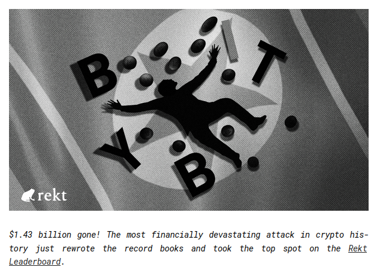
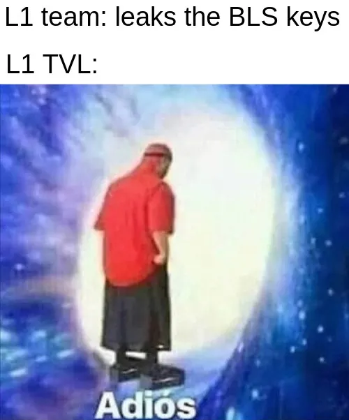

**Decentralization is a spectrum**. It is costly, hard to measure, and it seems like most users don't care at all. So a legitimate question is: **does it really matter?** The truth is, **most of the time, it doesn't**. But when it is eventually put to the test, you'd better hope your network is decentralized _enough_, or **you might lose just about everything**.

In this article, I'll explain what **risks centralized L1 networks** face and what **minimal requirements** one should look for to minimize them.

Of course, I am a **proponent of [progressive decentralization](/blog/introducing-balancervalidatormanager)** (that we address with the [Suzaku](https://suzaku.network) protocol). For the average project, it is **nearly impossible to start as an L1 network distributed** among many participants. But as we'll see, the **first steps toward decentralization** go a long way in drastically reducing risks.

**Note:** This article focuses more specifically on Avalanche L1s, but the same reasoning can be extended to most L1 networks.

## Preamble on hacks

Hacks (too) often make the headlines in crypto. We can classify them into 2 categories: smart contract hacks and OpSec hacks.

For a long time, **smart contract hacks** have been the most common, and also the area where **builders allocate the most budget** through the famous audits. However, **OpSec hacks have been on a recent streak**. Just this year, 2 come to mind immediately:

- [ByBit lost $1.4 billion](https://rekt.news/bybit-rekt) (!!!) in February 2025 because of a **Safe multisig front-end exploit**
- [Swissborg lost $41.5 million](https://rekt.news/swissborg-rekt) in September 2025 because of a **Kiln (staking) API exploit**

As AI auditing tools strengthen the robustness of smart contracts, the primary remaining attack vector becomes OpSec exploits: infra hacks (front-end, DNS, API), social engineering attacks, and supply chain attacks.

If **the biggest players in Web3 can be breached** (Kiln was the [biggest staking provider](https://www.stakingrewards.com/providers/all?sort=assets_under_management&timeframe=1y&order=desc&byChange=false&columns=assets_under_management%2Ccustom_aum_change%2Cstaking_wallets%2Cvsp%2Csupported_assets%2Ccountry&verifiedFirst=true) in crypto before being hacked), everyone is at risk: the blockchain service providers, the L1 teams, etc. Keep that in mind for the rest of the article.

## What's really at risk on an L1?

Several properties come to mind when we think about what we expect from a "decentralized" L1:

- **Liveness:** the network continues to operate even if some nodes fail or go offline
- **Censorship resistance:** no single entity can block or reverse transactions
- **Credible neutrality:** the network enforces rules impartially, treating all participants equally

But we often forget **the most important: the security of user funds**, and more specifically, of bridged funds. If all your users lose their funds, you can probably say goodbye to your project.

### Weaknesses of Avalanche ICM for small L1s

In the context of [Avalanche](https://avax.network/), an L1 communicates with other chains (esp. with the C-Chain for access to liquidity and integrations) using [ICM (InterChain Messaging)](https://build.avax.network/docs/cross-chain/avalanche-warp-messaging/overview), and pays a rent ([L1 validator fee](https://build.avax.network/blog/l1-validator-fee)) in AVAX to the P-Chain for that.

While extremely efficient, **ICM has known weaknesses**, specifically for chains with a **low number of validators**, and more importantly, a **low number of operators** (= independent entities running validators).

ICM relies on **[BLS](https://crypto.stanford.edu/~dabo/pubs/papers/BLSmultisig.html) signatures** to verify messages on destination chains, requiring a signature of at least **67% of the L1 weight** to be considered valid. A typical message would be the **bridging of assets** back to the Avalanche C-Chain.

If an **attacker gets access to BLS keys** corresponding to 67+% of the total weight, they can effectively **bridge all assets** without any corresponding transaction on the L1 itself.

### How an attacker can steal all the bridged TVL

Let's take the setup of the **average L1 today**:

- The L1 has **5 validators** operated by a single node provider
- The L1 team has **backups of the validator BLS keys**
- ICM is used to **bridge tokens to/from the C-Chain**

Here, at least 2 scenarios could lead to the compromise of the 5 validator BLS keys:

- The attacker gets access to 4/5 of the BLS key backups by **compromising a team member**
- **The node provider gets hacked**, and the attacker gets access to 4/5 of the BLS keys

Once the attacker has the BLS keys, they can **bridge out all the L1 TVL back to the C-Chain**.

Today, more than **80% of Avalanche L1s have less than 10 validators**, and often, there is a single operating entity (see [L1s stats](https://build.avax.network/stats/overview)).

## Why does decentralization solve this?

Pretty simple: the more the L1 validator set is distributed between independent operators, the more resilient it is to OpSec hacks.

There is a good old metric that measures _the minimum number of entities needed to collude to attack a chain_: the **Nakamoto coefficient**.

### What's the minimum "acceptable" decentralization?

**Nakamoto coefficient > 2** = Each operator controls strictly **less than 67% of the L1 total weight**

Relying on a single operating entity can be acceptable during bootstrap, but L1 teams should **onboard third parties ASAP** to eliminate any SPOF (Single Point Of Failure). The longer you wait and the product gains traction (= TVL grows), the bigger the risk of being targeted and eventually losing it all.

Of course, the higher the Nakamoto coefficient, the more you reduce risk. And you also improve the other properties of the chain: liveness, censorship resistance, and credible neutrality.

### Decentralized ≠ permissionless

Here, it is important to **differentiate decentralization and permissionlessness**.

Reaching an acceptable decentralization level **doesn't require being permissionless**: onboarding 2 trustworthy partners to your chain and giving them 20% of the network weight each already eliminates the SPOF.

By the way, there is a sticky **tendency in crypto for pushing permissionlessness** and solo-validators (coming from the Ethereum ethos), which is in reality **counterproductive for smaller networks**. You'll have to sacrifice other guarantees, esp. liveness, for the sake of pristine decentralization. But we're moving away from the topic, so I'll save that for another time.

## The other attack vector: validator set control

When we talk about **the validator set**, there are **the hardware operators**, but there is also the **selection mechanism**: how are validators selected to secure the network?

On Avalanche, since the [Etna](https://build.avax.network/blog/etna-enhancing-sovereignty-avalanche-l1s) (a.k.a. Avalanche9000) upgrade, an **L1 validator set is managed through smart contracts** (the [Validator Manager contracts](https://build.avax.network/docs/avalanche-l1s/validator-manager/contract)). A lot of different security models can be implemented: Proof of Authority, Proof of Stake, etc. Suzaku offers a way to transition from one to the other.

Like any smart contract, the security ultimately comes down to: **who has admin rights?** (in PoA, who can add/remove validators at will) And **who has upgrade rights?** (can change the security model and reshape the validator set). If both those accounts are **EOAs**, you've found yourself a **SPOF** again.

**Critical validator set management functions** must be either **secured by multiple parties** (multisig, governance) or immutable.

## Next step: Stages framework for Avalanche L1s

While all the risks and mitigations described above are well understood by savvy technical nerds like myself, the **majority of users and L1 builders** are **not totally aware** of them.

This is why I think that **we SHOULD have proper stages for Avalanche L1s**, very similar to what we can find on [L2BEAT](https://l2beat.com/) for Ethereum L2s, to (i) clearly **inform users of the risks** they are taking and (ii) **guide L1s on the road to improving security** through decentralization.

A [**discussion** around that topic](https://github.com/avalanche-foundation/ACPs/discussions/249) has just started on the ACP forum (on GitHub). I encourage all actors, Ava Labs, L1 builders, professional operators, and community members to participate.

Once significant progress has been made, count on me to publish a follow-up article on the matter!

## Conclusion

Kids don't care about decentralization, but responsible adults should.

If you're a builder and want to dig deeper into this topic, I'm always happy to chat and help you take action. Hit me up in DM on X ([@Nutymoon](https://x.com/Nutymoon)) or Telegram ([@Nuttymoon](https://t.me/Nuttymoon))!
